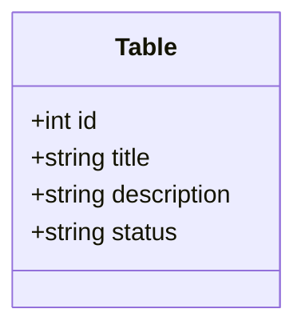
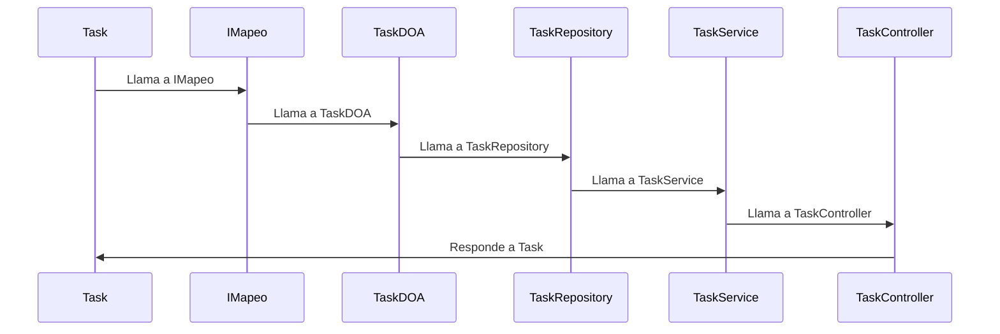

# This is a Repository for the "Weekend Milestone Breakdown"

## Milestone #1
- Succesfully created the SpringBoot project
- Tested the Params method
- Checked the endpoint /health to see if its working
- Posted it in github
Right now is basic as its intended for testing the succesful launch of the springboot

## Milestone #2
- Succesfully implementad Requests
- Add, Update and Delete, as well as a GET request
- All tested in the Postman Software
- @Valid used in the Post request linked to the ID of the task
- Uploaded to the Branch "Milestone-2". Squashed and merged.

## Milestone #4
- The integration of a DataBase
- The DB is based in H2 inside Springboot
- The diagram for it.

- The UML diagram for task craetion Flow

